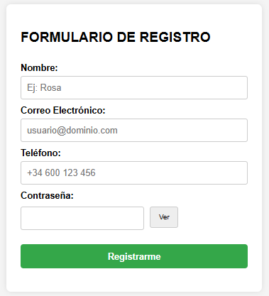
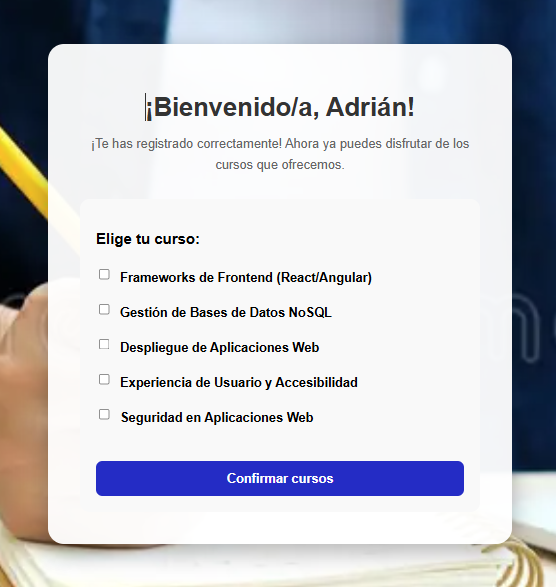
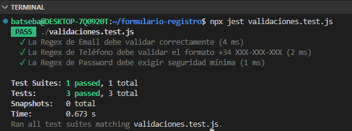

# FORMULARIO DE REGISTRO VALIDADO 🛡️

Sistema de registro de usuarios con validaciones avanzadas mediante **Expresiones Regulares (Regex)** y garantía de calidad a través de **pruebas unitarias**.

## 📸 CAPTURAS DEL PROYECTO:
En esta sección se muestra el funcionamiento visual y técnico del formulario.

### 🖥️ Interfaz del Formulario y Éxito

*Descripción: Formulario dinámico con validación en tiempo real de campos críticos (Email, Teléfono y Password).*


*Descripción: Interfaz de confirmación tras un registro exitoso, permitiendo la selección de cursos.*

### 🧪 Validación y Pruebas Unitarias (Jest)

*Descripción: Evidencia técnica de la terminal mostrando el "PASS" de las pruebas unitarias diseñadas para validar la lógica de las Regex.*

<details>
<summary><b>📂 Ver log detallado de la terminal (Prueba del 23/03/2026)</b></summary>

```text
RESULTADO DE LA PRUEBA (EJECUTADO EL 23/03/2026):
batseba@DESKTOP-7Q0920T:~/formulario-registro$ npx jest validaciones.test.js
 PASS  ./validaciones.test.js
  ✓ La Regex de Email debe validar correctamente (4 ms)
  ✓ La Regex de Teléfono debe validar el formato +34 XXX-XXX-XXX (1 ms)
  ✓ La Regex de Password debe exigir seguridad mínima (1 ms)

Test Suites: 1 passed, 1 total
Tests:       3 passed, 3 total
Snapshots:   0 total
Time:        0.484 s
Ran all test suites matching validaciones.test.js.

```
</details>


### 🛠️ FUNCIONALIDADES TÉCNICAS:

- Validación de Email: Comprobación rigurosa de formato estándar de correo electrónico.

- Validación de Teléfono: Restricción específica para formato español (+34 XXX-XXX-XXX).

- Validación de Password: Exigencia de seguridad mínima (longitud, caracteres especiales y números) para proteger al usuario.

- Pruebas Automatizadas: Implementación de Jest para verificar que la lógica de validación es infalible.


### 🚀 TECNOLOGÍAS UTILIZADAS:

- Frontend: HTML5, CSS3 y JavaScript (ES6+).

- Testing: Jest (JavaScript Testing Framework).

- Herramientas: NPM y Git.


### 📥 INSTALACIÓN Y EJECUCIÓN:

1. Clona el repositorio:
   git clone https://github.com/Bat-seba/formulario-registro-validado.git

2. Instala las dependencias:
   npm install

3. Ejecuta las pruebas:
   npm test

4. Visualización: Abre el archivo index.html en tu navegador.